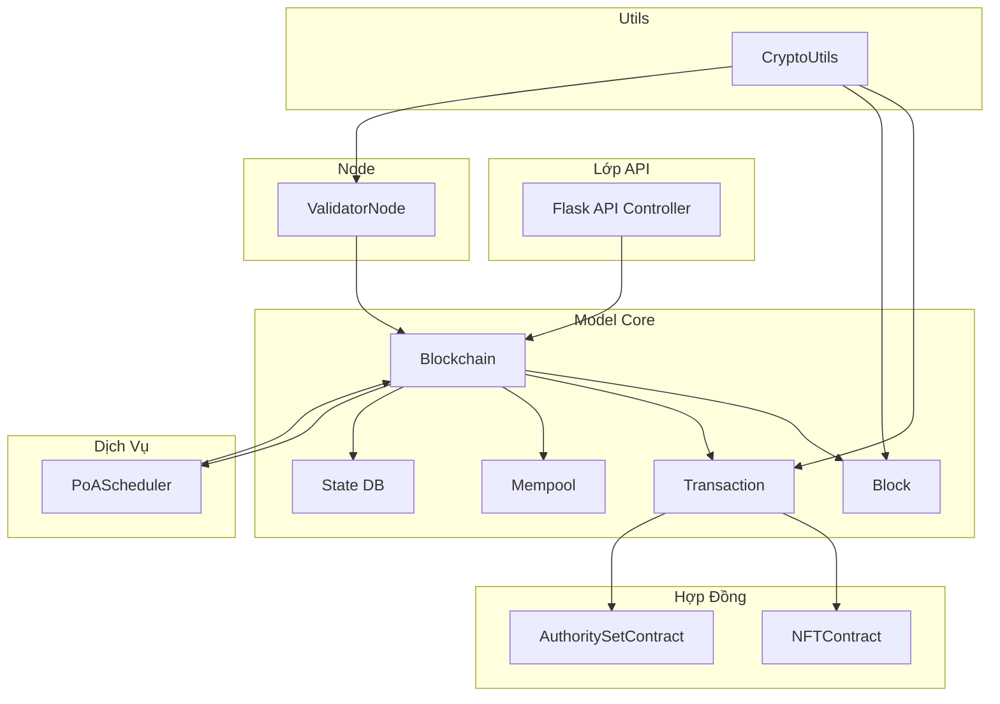
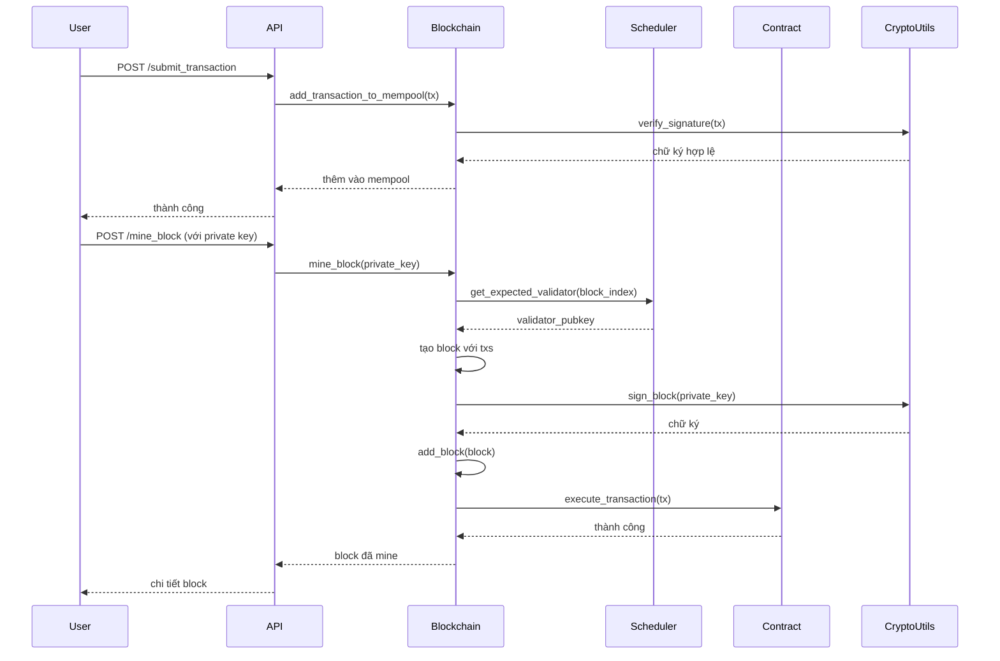
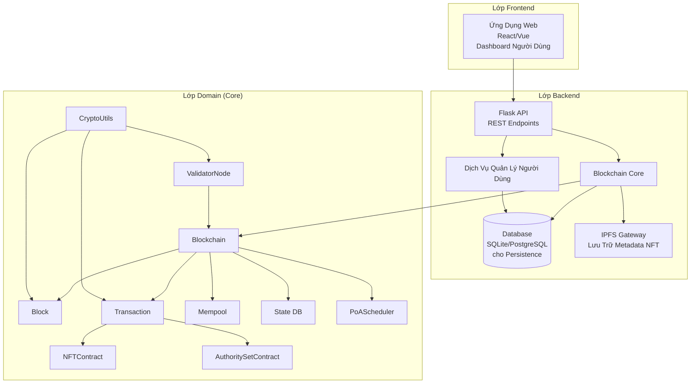
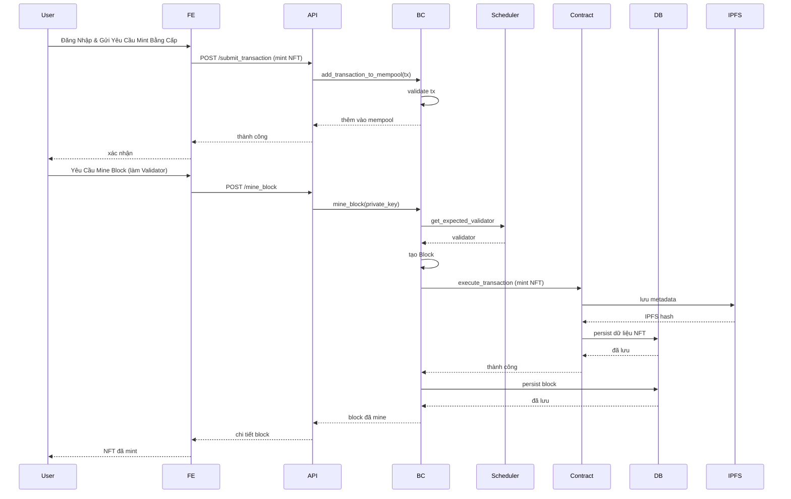
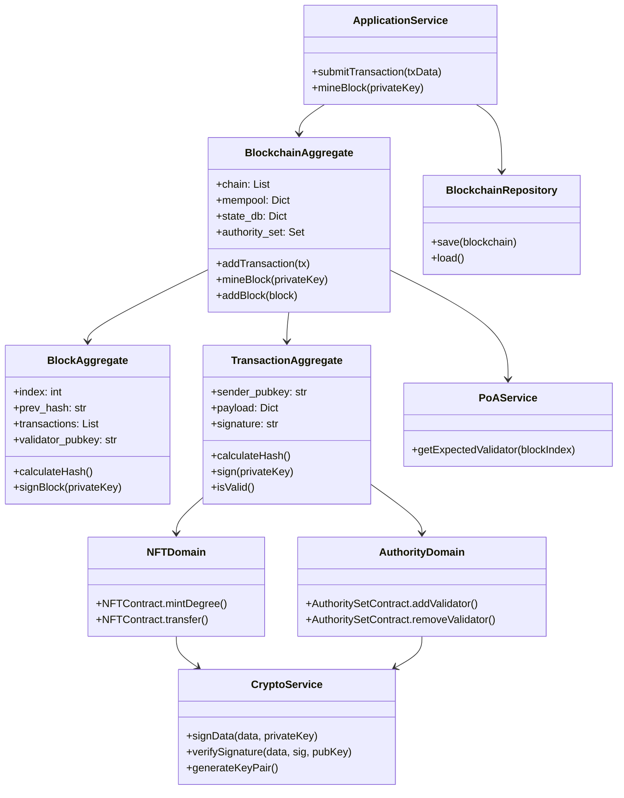
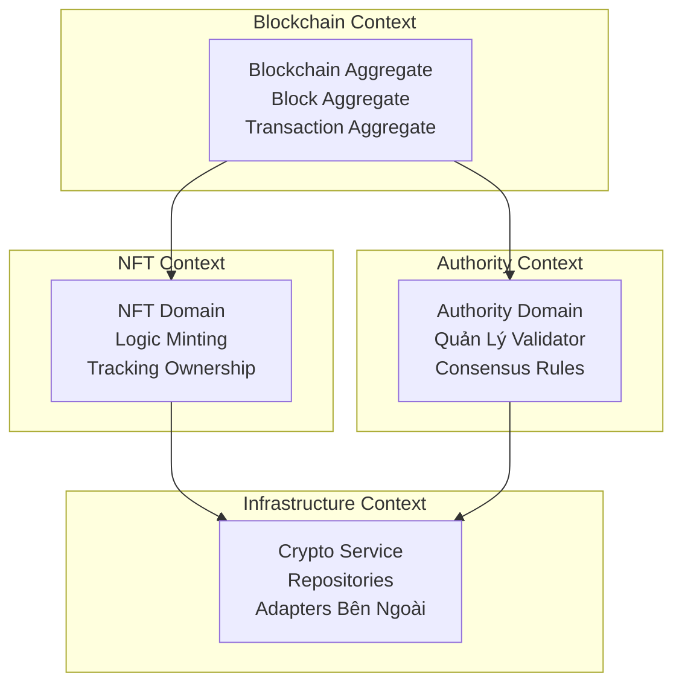
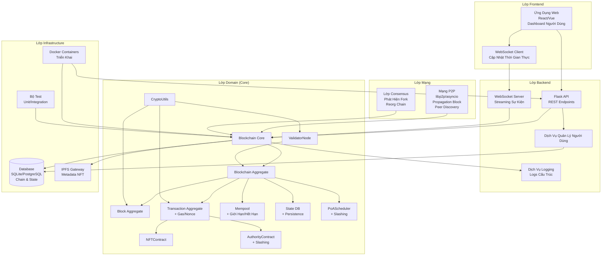
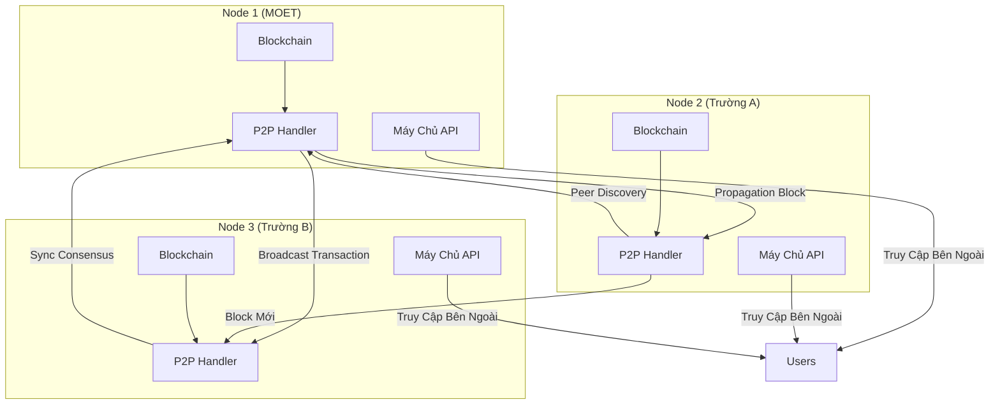
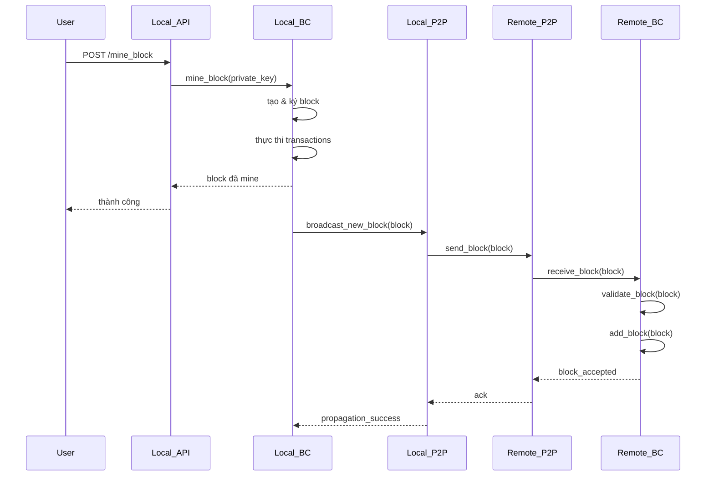

# Sơ Đồ Thiết Kế EduChain

## 1. Sơ Đồ Kiến Trúc Hệ Thống Ban Đầu (Component Diagram)

## 2. Sơ Đồ Tương Tác Component Ban Đầu (Sequence Diagram)

## 3. Sơ Đồ Kiến Trúc Hệ Thống Full-Stack (Component Diagram)

Sơ đồ này bao gồm frontend và backend mở rộng:

## 4. Sơ Đồ Tương Tác Component Đã Cập Nhật (Sequence Diagram)

Sơ đồ này hiển thị luồng người dùng đầy đủ từ frontend đến backend:

## 5. Sơ Đồ Phát Triển Domain Layer Có Thể Mở Rộng (DDD Class Diagram)

## 6. Sơ Đồ Bounded Contexts

## 7. Sơ Đồ Kiến Trúc Hệ Thống Toàn Diện (Bao Gồm Các Tính Năng Thiếu)

## 8. Sơ Đồ Mạng P2P
Hiển thị cách các node kết nối và giao tiếp:

## 9. Sơ Đồ Tương Tác Với P2P
Luồng mining và propagation block qua mạng:

